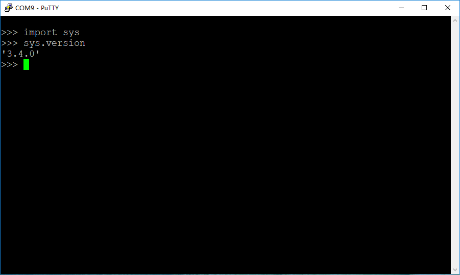
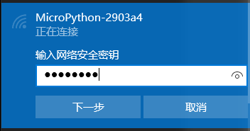
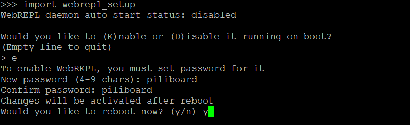

### 准备
- 一块写入micropython固件的8266开发版（piliboard开发板）
- putty（Windows工作站）

用途：建立到linux的ssh连接

下载地址：https://www.chiark.greenend.org.uk/~sgtatham/putty/latest.html

- USB转串口驱动
  - Windows
http://www.wch.cn/download/CH341SER_ZIP.html
  - MacOS
http://www.wch.cn/download/CH341SER_MAC_ZIP.html

### REPL
简单的说，REPL就是一个交互式命令窗口，命令符合python的语法。

REPL的用户输入端，可以是一个终端命令窗口（如putty），也可以是一个浏览器（这时候因为基于web，所以称为WebREPL）。



无论是在REPL还是WebREPL环境中，我们都控制与操作piliboard；在WebREPL中，我们还能进行文件的上传与下载。

### 连接

有两种方法可以建立与Piliboard的连接，进入REPL环境。
- WIFI+WebREPL
- 串口+REPL

#### WIFI+WebREPL
1. 建立WIFI连接

Piliboard通电后，工作站电脑连接Piliboard的WIFI AP。

名称为`MicroPython-xxxxxx`，密码为`micropythoN`（注意最后一个`N`为大写）



2. WebREPL

访问http://micropython.org/webrepl/

或者下载[webrepl2.html](webrepl2.html)保存在本地，用浏览器打开。

连接：`ws://192.168.4.1:8266/`

初始密码为：`piliboard`

进入WebREPL交互界面。

注：
1. 当设置了PiliBoard的常规WIFI连接之后，后续就可以不用先将工作站连接到PiliBoard的AP热点上，直接将PiliBoard的IP替换上面的`192.168.4.1`进行WebREPL的连接即可。
2. 如果WebREPL没有默认打开，这种情况下连接时系统会返回`Disconnected`。这时需要先建立串口连接，然后手工打开WebREPL——参见"配置WebREPL"

#### 串口+REPL
1. Windows（putty）

在命令行窗口输入`mode`，查看PiliBoard连接的串口号。


打开putty，连接对应串口，波特率设为115200


2. MacOS

进入：`screen /dev/ttyUSB0 115200`

退出：`ctrl+a` `/`

### 网络配置

在esp8266上，网络配置即时生效，重启后不会丢失。

在配置网络前，运行以下命令，引入对应的网络库：

`import network`

#### 正常网卡配置
配置网卡，连接到热点xxxx，密码yyyy

```python
sta_if = network.WLAN(network.STA_IF)
sta_if.active(True)
sta_if.connect('xxxx','yyyy')
```

可以用下面命令查看网卡是否激活、连接是否成功，以及被分配的IP地址设置：

`sta_if.active()`

`sta_if.isconnected()`

`sta_if.ifconfig()`

关闭正常网卡：

`sta_if.active(False)`

#### AP热点配置
配置热点aaaa，密码bbbb

```python
ap_if = network.WLAN(network.AP_IF)
ap_if.active(True)
ap_if.config(essid="aaaa", password="bbbb")
```

可以用下面命令查看热点网卡的一些信息：

`ap_if.active()`

`ap_if.ifconfig()`

`ap_if.config("essid")`

关闭网络热点功能：

`ap_if.active(False)`

### 配置WebREPL
在REPL交互命令窗口中，可以输入以下命令，进行WebREPL的设置

`import webrepl_setup`


