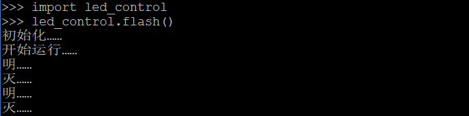

### 控制LED灯
Piliboard开发板上有一盏连接GPIO 5号口的LED灯，可以用下面命令进行打开和关闭。
```python
import machine
p5 = machine.Pin(5,machine.Pin.OUT)
```
开启：
`p5.value(1)`
关闭：
`p5.value(0)`
查看当前状态：
`p5.value()`

我们可以写个程序，让它一秒钟闪动一次：
```python
import machine
import time
p5 = machine.Pin(5, machine.Pin.OUT)
while True:
    p5.value(1)
    time.sleep_ms(1000)
    p5.value(0)
    time.sleep_ms(1000)
```
*
注：
- 因为在REPL中会自动缩进，所以以上程序不能直接copy+paste到REPL中。
- 需要先`ctrl+e`进入黏贴模式，然后copy+paste，然后`ctrl+d`退出黏贴模式运行。
- 或者直接手工一行行输入或黏贴，此时缩进会自动出现。
- `ctrl+c`终止程序运行。
*

### 文件操作

#### 文件操作命令
```python
import os

# 查看文件系统状态
os.statvfs('/')

# 列出当前目录下文件
os.listdir()

# 创建目录
os.mkdir('xxxx')

# 删除目录
os.rmdir('xxxx')

# 列出文件状态
os.stat('test.py')

# 修改文件名
os.rename('test.py','test.py.bak')

# 删除文件
os.remove('test.py.bak')

# 打印文件内容
f=open('boot.py','r')
f.read()
f.close()
```

#### WebREPL中文件上传与下载


### 程序样例
#### 程序
下面程序完成每秒钟piliboard上LED灯的明灭转换。

将文件保存为led_control.py，同时通过WebREPL上传到piliboard根目录：
```python
import machine
import time

def flash(time_step=1000):
    print("初始化……")
    # PiliBoard的LED灯在5号GPIO上
    p5 = machine.Pin(5, machine.Pin.OUT)

    print("开始运行……")
    while True:
        print("明……")
        p5.value(1)
        time.sleep_ms(time_step)

        print("灭……")
        p5.value(0)
        time.sleep_ms(time_step)
```

#### 运行
在命令行中输入以下命令，运行程序：
`import led_control`
`led_control.flash()`

按`ctrl+c`中断退出

#### 启动运行
将以下代码存为`main.py`，上传到piliboard根目录。每次piliboard上电启动后即自动运行。
```python
import led_control
led_control.flash()
```
同样，在REPL窗口，按`ctrl+c`中断退出

### 注意点
- 在WebREPL上传文件，需要重新选择文件进行上传，否则可能会上传浏览器缓存的文件。
- 对于已经import的模块，如果修改了文件后，需要删除此模块后，重新import：
```python
import sys
del sys.modules['mymodule']
import mymodule
```
