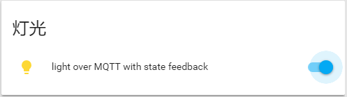

[TOC]
**
本文中所有命令，假定安装的mqtt服务器在`10.0.1.105`上提供服务，端口号采用默认的`1883`，用户名为`pi`，密码为`hachina`。
在实际运行以下的命令时，请根据您环境的实际情况，修改以上的值。
**
## MQTT基础知识
### 基础概念
https://www.hachina.io/docs/3926.html

### 进阶概念
https://www.hachina.io/docs/4431.html

## MQTT软件安装
### 准备MQTT服务器
#### 树莓派上Mosquitto安装
##### 安装
`sudo apt-get install mosquitto`

##### 配置
创建文件`/etc/mosquitto/passwd`，并增加用户`pi`（你也可以取个不一样的名字），设置密码：
`sudo mosquitto_passwd -c /etc/mosquitto/passwd pi`

`sudo nano /etc/mosquitto/conf.d/allow.conf`
```conf
allow_anonymous false
password_file /etc/mosquitto/passwd
```

##### 重启生效
`sudo systemctl restart mosquitto`


#### HomeAssistant内置的MQTT服务器端
在HA配置文件中，如果mqtt域不配置broker，将会启动一个HBMqtt的服务器端。
```yaml
# 在mqtt配置项中，不出现broker配置，HA将启动一个HBMqtt服务
mqtt:
```
HBMqtt的运行参数为：
- 用户名：homeassistant
- 密码：homeassistant的web访问密码
- 协议版本：3.1.1
注：如果mosquitto客户端要连接此服务器端，需要指定协议为`-V mqttv311`，否则会有报错

#### 其它
- test.mosquitto.org也可以作为mqtt服务器，只是其只支持匿名访问，没有任何安全性，可以用于测试
- 各种云，有支持mqtt协议的云端可以直接租用，比如[cloudmqtt](https://www.cloudmqtt.com/)

### 准备MQTT客户端
安装一个MQTT客户端，对于过程调试与错误的排查，非常有用。
#### mosquitto客户端
`sudo apt-get install mosquitto-clients`
#### mqttfx-图形化客户端
http://mqttfx.jensd.de/index.php/download

### 测试
分别在两个窗口运行以下程序，观察输出。
监听所有发布信息：
*`-h`指定连接的MQTT服务器，`-u`指定连接使用的用户名，`-P`（大写）指定连接密码*
`mosquitto_sub -t "#" -d -u pi -P hachina -h 10.0.1.105`

发布信息：
`mosquitto_pub -t hello/world -m "HELLO, HAChian.io"  -h 10.0.1.105 -u pi -P hachina`

## 传感器
实现一个MQTT温湿度传感器，每10秒上报一次信息。
代码：[dht11.py](dht11.py)

### 运行
将以下的命令中，`10.0.1.105`替换为您的MQTT服务器，`pi`替换为您MQTT服务上的用户名，`hachina`替换为您的密码。
`import mqtt_stepbystep.dht11 as dht11`
`dht11.main(mqtt_broker='10.0.1.105',mqtt_port=1883,mqtt_user="pi",mqtt_password="hachina")`
*
注：如果您没有搭建自己的mqtt服务器，此处可以连接`test.mosquitto.org`：
`dht11.main(mqtt_broker='test.mosquitto.org')`
*
### homeassistant中温湿度传感器的配置
```yaml
# MQTT服务器信息配置
mqtt:
  # MQTT Broker的IP地址或者域名
  broker: 10.0.1.105
  # MQTT Broker的端口号，缺省为1883
  port: 1883
  # 用户名
  username: pi
  # 密码
  password: hachina

sensor:
  # MQTT传感器
  - platform: mqtt
    name: "Temperature"
    state_topic: "my/test/dht11/temperature"
    unit_of_measurement: "°C"
  - platform: mqtt
    name: "Humidity"
    state_topic: "my/test/dht11/humidity"
    unit_of_measurement: "%"
```

## 简单控制（MQTT程序的运行、监测）
实现一个无状态反馈的MQTT灯。
代码：[simple_control.py](simple_control.py)

### 运行
`import mqtt_stepbystep.simple_control as simple_control`
`simple_control.main(mqtt_broker='10.0.1.105',mqtt_port=1883,mqtt_user="pi",mqtt_password="hachina")`

此时，我们已经准备好了一盏接受MQTT控制的灯了。

### 手工MQTT控制
#### 使用mosquitto_pub命令
开灯：
`mosquitto_pub -h 10.0.1.105 -t "my/test/topic" -m "ON" -u pi -P hachina`
关灯：
`mosquitto_pub -h 10.0.1.105 -t "my/test/topic" -m "OFF" -u pi -P hachina`

#### 使用MQTTFX客户端
设置到mqtt服务器的连接：

发布开灯（关灯）命令：


### homeassistant中mqtt灯的配置
```yaml
# MQTT服务器信息配置
mqtt:
  broker: 10.0.1.105
  port: 1883
  username: pi
  password: hachina

light:
  # MQTT灯
  - platform: mqtt
    name: "Demo light over MQTT"
    command_topic: "my/test/command"
```


### 过程监测
运行以下命令，可以监控MQTT服务器上所有的发布信息：
`mosquitto_sub -h 10.0.1.105 -t "#" -d -u pi -P hachina`

## 状态反馈
实现一个带状态反馈的MQTT灯，将开/关灯命令执行的结果发布给mqtt服务器。
代码：[state_feedback.py](state_feedback.py)

### 运行
`import mqtt_stepbystep.state_feedback as state_feedback`
`state_feedback.main(mqtt_broker='10.0.1.105',mqtt_port=1883,mqtt_user="pi",mqtt_password="hachina")`

### homeassistant中的配置
```yaml
# MQTT服务器信息配置
mqtt:
  broker: 10.0.1.105
  port: 1883
  username: pi
  password: hachina

light:
  # MQTT灯
  - platform: mqtt
    name: "light over MQTT with state feedback"
    command_topic: "my/test/command"
    # 增加了state_topic
    state_topic: "my/test/state"
    availability_topic: "my/test/availability"
```
此时，在hass的前端，灯的显示与上例是有区别的：


## lastwill
当piliboard断开与MQTT服务器的连接后，自动在MQTT服务器上发布消息，告知灯已经下线了。
代码：[lastwill.py](lastwill.py)

### 运行
`import mqtt_stepbystep.lastwill as lastwill`
`lastwill.main(mqtt_broker='10.0.1.105',mqtt_port=1883,mqtt_user="pi",mqtt_password="hachina")`

### homeassistant中的配置
与上例中完全一致
将piliboard断电后一段时间（60秒），前端的状态自动变为：


## 自动发现
配置mqtt设备的各种topic还是有一些繁杂的，设备可以直接发布这些配置信息，在homeassistant中自动发现mqtt设备进行接入。
代码：[discovery.py](discovery.py)

### 运行
`import mqtt_stepbystep.discovery as discovery`
`discovery.main(mqtt_broker='10.0.1.105',mqtt_port=1883,mqtt_user="pi",mqtt_password="hachina")`

### homeassistant中的配置
在mqtt域中配置了自动发现之后，homeassistant中不再需要配置具体的设备信息。
详见：https://www.home-assistant.io/docs/mqtt/discovery/
```yaml
# MQTT服务器信息配置
mqtt:
  broker: 10.0.1.105
  port: 1883
  username: pi
  password: hachina
  # 设置为自动发现mqtt设备
  discovery: true
```

## 亮度PWM调制
不仅仅能开关，还能调亮度。这时候会有两个mqtt命令topic，一个控制开关，一个控制亮度。
代码：[pwm_light.py](pwm_light.py)

### 运行
`import mqtt_stepbystep.pwm_light as pwm_light`
`pwm_light.main(mqtt_broker='10.0.1.105',mqtt_port=1883,mqtt_user="pi",mqtt_password="hachina")`

### homeassistant中的配置
采用自动发现机制，配置与上一例中完全一样。


## 更稳定的mqtt客户端
引入umqtt.robust库，基于umqtt.simple上的更稳定的mqtt客户端库。接口与umqtt.simple完全一致。
代码：[robust_pwm_light.py](robust_pwm_light.py)

### 运行
`import mqtt_stepbystep.robust_pwm_light as robust_pwm_light`
`robust_pwm_light.main(mqtt_broker='10.0.1.105',mqtt_port=1883,mqtt_user="pi",mqtt_password="hachina")`
