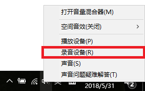
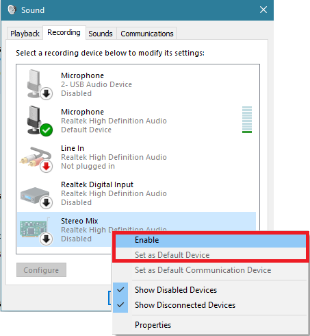
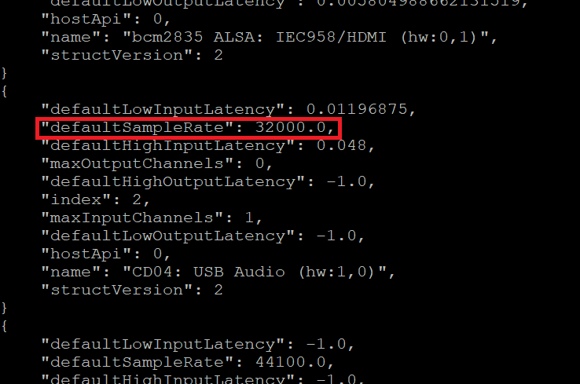
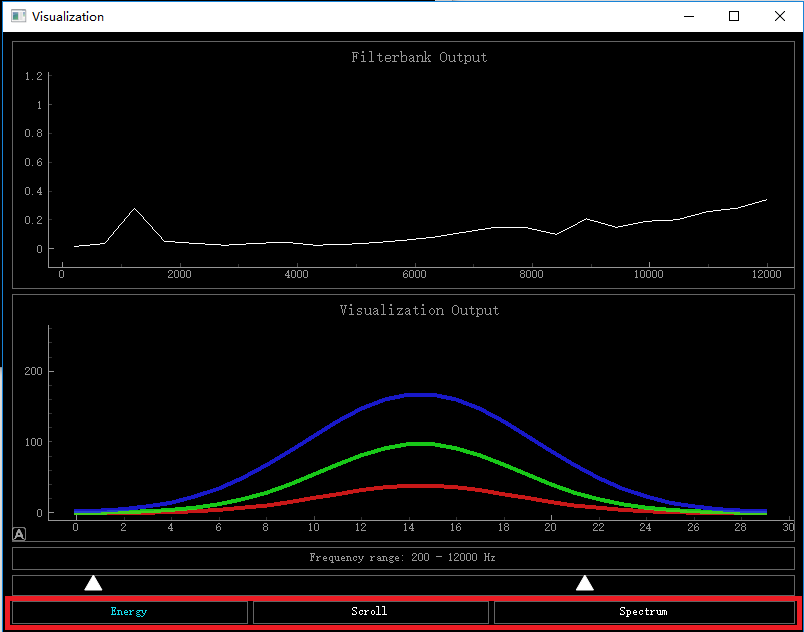
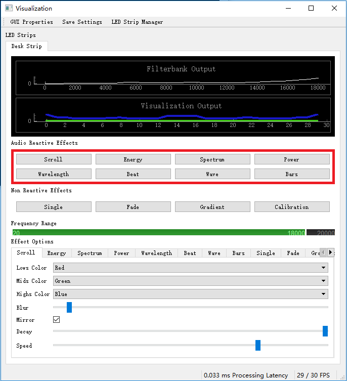

[toc]
## 整体过程

当灯带运行在`UDP Receiver`模式时，它会接收UDP7777号端口上的包，并根据包的内容，亮动LED灯带，调整每一个LED灯珠的颜色与亮度。

本目录中包含了两套声音与转化程序，`audio-reactive-led-strip`和`Systematic-LEDs`，前者相对成熟，但闪烁模式相对较少；后者不完全成熟，但闪烁模式相对较多。

## Windows基础准备
### 基础安装
安装python3.x版本
以管理员身份运行以下命令，安装需要的pip库：
`pip install numpy scipy pyaudio pyqt5 pyqtgraph`

### 声音设备
在声音设备管理中找到录用设备（可能需要打开非工作状态的设备），然后选择你需要采集声音的设备作为默认输入设备。
**如果您需要采集麦克风的声音，选择对应的麦克风设备；如果您需要采集本计算机播放的声音，请选择“立体声混音（Stereo Mix）”。**




可以运行以下命令，观察对应的声音输入设备(采样率)：
`python3 list_audio_device.py`


## 树莓派基础准备
### 基础安装
运行以下命令，安装需要的库：
```
sudo apt-get update
sudo apt-get install python3-numpy python3-scipy python3-pyaudio
sudo apt-get install python3-pyqt5
sudo pip3 install pyqtgraph
```
### 声音设备
树莓派并不自带声音输入设备，需要连接USB麦克风。连接后，运行以下命令，观察对应的声音输入设备(采样率)：
`python3 list_audio_device.py`

## MacOS基础准备
### 基础安装
运行以下命令，安装需要的库：
```
brew install portaudio
pip3 install numpy scipy pyaudio pyqt5 pyqtgraph
```
注：如果`brew`没有安装，请先安装`brew`：
`/usr/bin/ruby -e "$(curl -fsSL https://raw.githubusercontent.com/Homebrew/install/master/install)"`


## audio-reactive-led-strip
本程序来自https://github.com/scottlawsonbc/audio-reactive-led-strip
在发送UDP包的格式上有所改动。

### 配置
编辑`config.py`文件，修改其中：
- UDP_IP：对应的piliboard的ip地址
- N_PIXELS：led灯带中led的数量
- MIC_RATE：对应声音设备的采样率

### 运行
- 将led灯带置于`UDP Receiver`模式
- 测试：运行`led.py`，此时会有跑动的红绿蓝的灯显示在灯带上，标识UDP通讯正常。
- 运行：运行`visualization.py`，播放音乐或其它声音，此时灯带会随着音乐而动。
- 可以在界面上修改音乐随动的亮灯模式（下图中红框）


## Systematic-LEDs
本程序来自https://github.com/not-matt/Systematic-LEDs/tree/master/python

### 配置
编辑`lib/config.py`文件，修改其中：
- UDP_IP：对应的piliboard的ip地址
- UDP_PORT：piliboard上监听的UPD端口，7777
- N_PIXELS：led灯带中led的数量
- MIC_RATE：对应声音设备的采样率

### 运行
- 将led灯带置于`UDP Receiver`模式
- 运行：运行`main.py`，播放音乐或其它声音，此时灯带会随着音乐而动。
- 可以在界面上修改音乐随动的亮灯模式（下图中红框）
`注：有些模式并没有完全实现`

